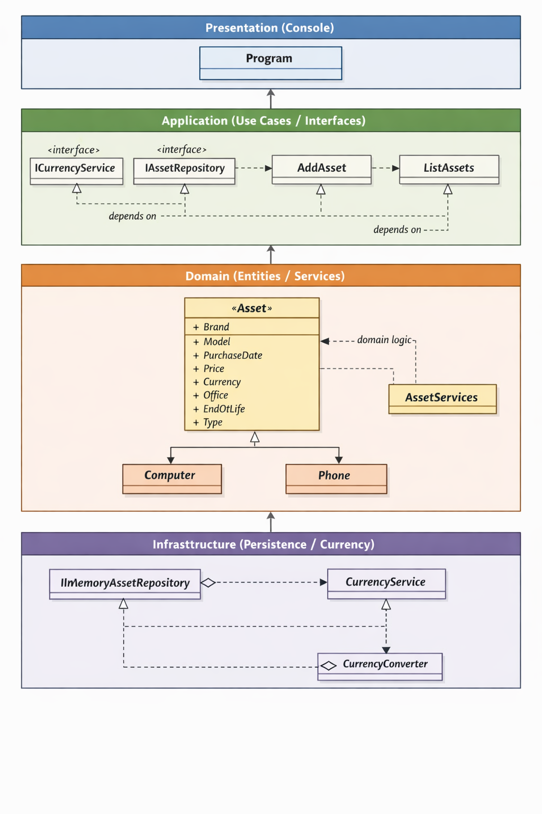

# WeeklyProject03_AssetTracking

Small console application to track company assets (computers and phones). The app stores simple asset records, calculates end-of-life (EoL) and prints a formatted asset list with local and converted prices.

Key points
- Language: C# targeting .NET 10
- Project style: layered architecture (Presentation, Application, Domain, Infrastructure)

## Features
- Add assets via interactive console input
- Sample/test assets are inserted at startup for quick inspection
- List assets grouped by office/type with price converted to USD using a currency service
- Simple domain model with `Asset`, `Computer`, and `Phone`

## Getting started
The console app will prompt for new assets. Enter `Q` for the office prompt to quit input mode and display the list.

## Usage notes
- Purchase date must be entered as `yyyy-MM-dd`.
- Supported currencies are read from the `CurrencyService` at startup; input must match an available ISO currency code (e.g. `USD`, `EUR`, `SEK`).

## Project structure (high level)
- `Program.cs` — Console UI / entry point
- `Application/Use_Cases` — Use cases: `AddAsset`, `ListAssets`
- `Application/Interfaces` — Port interfaces such as `ICurrencyService` and repository interface
- `Domain/Entities` — Domain models: `Asset`, `Computer`, `Phone`
- `Domain/Services` — Domain-level logic (EoL calculation, validations)
- `Infrastruture` — Implementations: in-memory repository and currency service/converter

## Design
This project follows a layered clean architecture:
- Presentation (console) depends on Application use cases
- Application defines ports and coordinates Domain and Infrastructure
- Domain contains entity and business rules
- Infrastructure implements persistence and external services (currency)

## System Architecture (UML)

## Future work / Improvements
- Replace console input with a small API or UI
- Add persistence to a database
- Add CRUD operations and validation feedback
- Add unit and integration tests
- Improve currency fetching / caching and error handling

